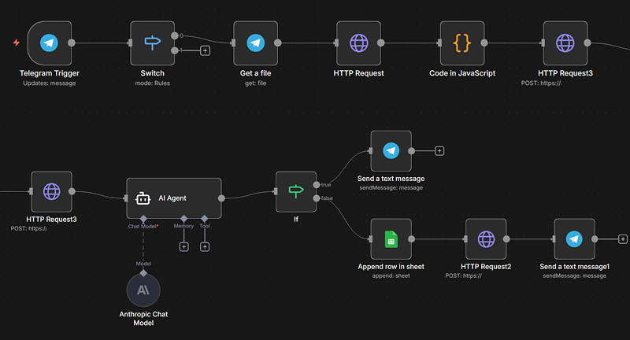
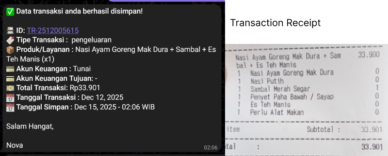
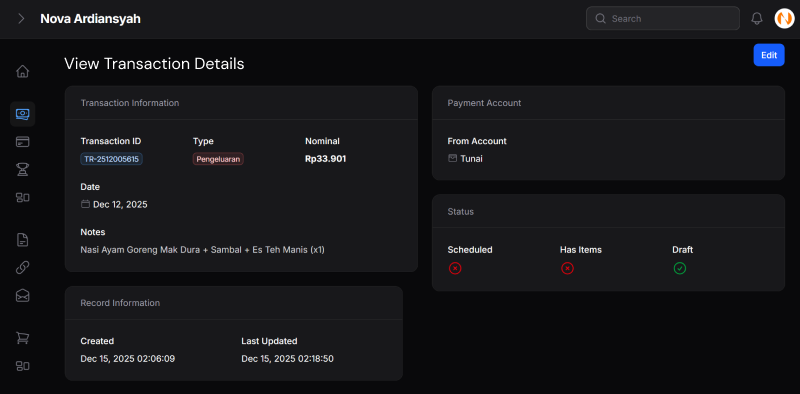
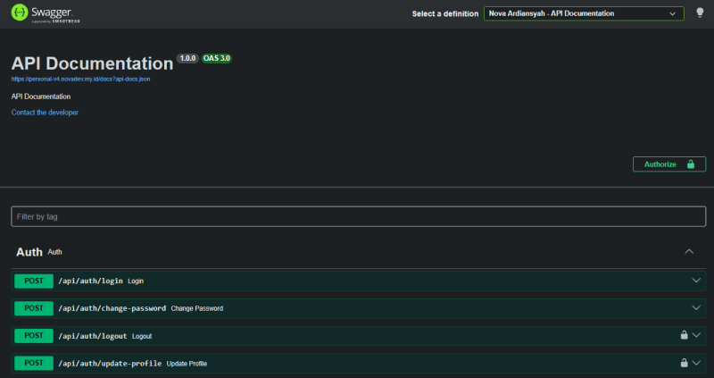

# Personal Filament v4 Admin Panel

Hi Future Developer,

Welcome to the **Personal Filament v4 Admin Panel**! This project is an open-source admin panel built with the latest Laravel 12 and Filament PHP 4, designed for personal utility management and more.

This repository is the public evolution of my previous public admin panel project (originally developed with Laravel 12 and Filament PHP 3). Here, I’ve upgraded to Filament 4 and made the core features available for the community—ideal for learning, collaboration, or as a starting point for your own admin panel. To support public usage, user roles and permissions have been carefully separated and managed.

While this repository is public, please note that important configuration files such as `.env` and the application database are not provided. Although you can access and use the live version, access to the production database and sensitive configuration remains restricted for security reasons. However, I’m always open to discuss and help if you need guidance regarding configuration or setup.

## Dazzling Tech Stack! ⚡

- [Laravel 12](https://laravel.com/)
- [Filament PHP 4](https://filamentphp.com/)
- [PHP 8.2+](https://www.php.net/)
- [MySQL](https://www.mysql.com/)

## Sneak Peek 🌟

Coming soon!

## AI Automation Integration 🤖

This project features **AI-powered transaction recording** integrated with Telegram! Simply send a photo of your receipt or bill to the Telegram bot, and the AI will automatically:

- **Extract transaction data** from the image (amount, product/service, date, etc)
- **Categorize the transaction** (Expense, Income, Transfer, or Withdrawal)
- **Match payment accounts** based on receipt context or user hints
- **Create the transaction record** directly in your Personal Admin Panel

## API Documentation 📚

This project now includes **integrated API documentation** powered by [L5-Swagger](https://github.com/DarkaOnLine/L5-Swagger)! The API documentation provides a comprehensive overview of all available REST API endpoints with:

- **Interactive API Explorer** - Test endpoints directly from the documentation
- **Bearer Token Authentication** - Secured with Laravel Sanctum
- **Request/Response Examples** - Clear examples for each endpoint
- **Validation Rules** - Detailed parameter requirements

Access the API documentation at: `/api/documentation`

## Demo Credentials 🧪

Coming soon!

## Licensing Groove 🕺

Exciting news! This project is grooving to the rhythm of the [MIT License](LICENSE).

Feel free to use, modify, and share it with the world. Just remember to keep the original license intact. Let's spread the joy of coding together! 🚀

## Code of Conduct 🤝

We believe in fostering a welcoming and inclusive environment for everyone. Please be respectful, considerate, and constructive in all interactions. By participating in this project, you agree to uphold our [Code of Conduct](CODE_OF_CONDUCT.md). Let's collaborate and make this community awesome together!

## Let's Connect! 📞

Need to chat? Feel free to drop me a line via [Email](mailto:novaardiansyah78@gmail.com) or hit me up on [WhatsApp](https://wa.me/6289506668480?text=Hi%20Nova,%20I%20have%20a%20question%20about%20your%20project%20on%20GitHub:%20https://github.com/novaardiansyah/personal-v4). I'm just a message away, ready to groove with you! 📩

## Project Status 🚀

---

**Happy coding and collaborating!**
— Nova Ardiansyah
