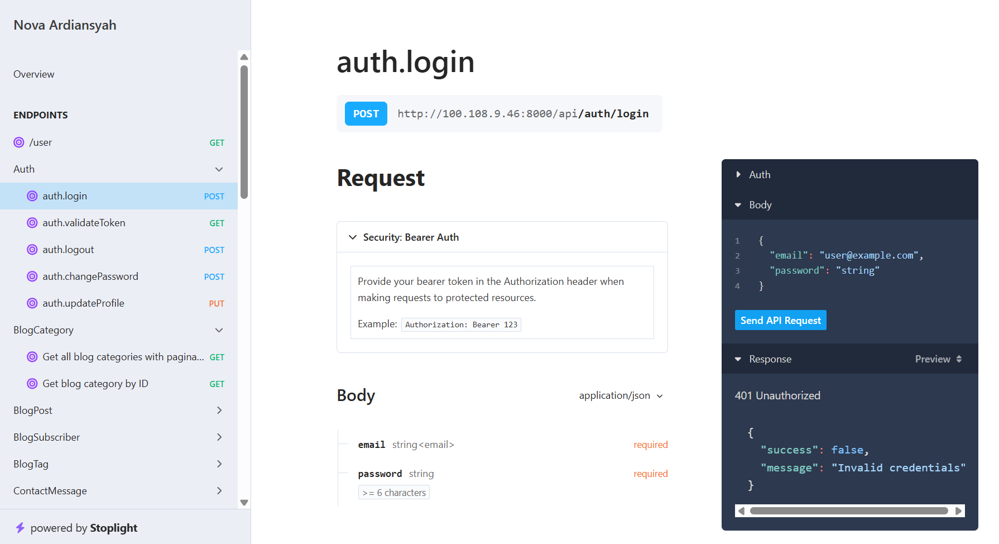

# Personal Filament v4 Admin Panel

Hi Future Developer,

Welcome to the **Personal Filament v4 Admin Panel**! This project is an open-source admin panel built with the latest Laravel 12 and Filament PHP 4, designed for personal utility management and more.

This repository is the public evolution of my previous public admin panel project (originally developed with Laravel 12 and Filament PHP 3). Here, I’ve upgraded to Filament 4 and made the core features available for the community ideal for learning, collaboration, or as a starting point for your own admin panel. To support public usage, user roles and permissions have been carefully separated and managed.

## Dazzling Tech Stack

- [Laravel 12](https://laravel.com/) - Backend PHP Framework
- [Filament PHP 4](https://filamentphp.com/) - TALL Stack Admin Panel
- [PHP 8.2+](https://www.php.net/) - Server-side language
- [MySQL](https://www.mysql.com/) - Database Management
- [Tailwind CSS](https://tailwindcss.com/) - CSS Framework

## Demo Version
You can explore the latest features on our demo site: [https://personal-v4-demo.novaardiansyah.id](https://personal-v4-demo.novaardiansyah.id)

**Credentials:**
- **Email:** `admin@novadev.my.id`
- **Password:** `zWZcWqm$Q8aP45ak`

> Note: Some features are limited in the demo version and may not function as they would in production. If you encounter any bugs or issues, please feel free to [open an issue](https://github.com/novaardiansyah/personal-v4/issues).

## AI Automation Integration
This project features **AI-powered transaction recording** integrated with Telegram! Simply send a photo of your receipt or bill to the Telegram bot, and the AI will automatically extract transaction data, categorize it, and match payment accounts.

## API Documentation
This project includes **integrated API documentation** automatically generated by [Scramble](https://scramble.dedoc.co/). Access it at: [https://personal-v4.novadev.my.id/docs/api](https://personal-v4.novadev.my.id/docs/api)

> **Note:** We have migrated from L5-Swagger to Scramble for a more seamless and automated documentation experience.

## Mobile App Integration

This project is built to work seamlessly with the **NovaApp** mobile application. NovaApp is a modern finance management app built with React Native, Expo, and TypeScript.

- **Mobile App Repository**: [https://github.com/novaardiansyah/NovaApp](https://github.com/novaardiansyah/NovaApp)

## Credentials & Environment

While this repository is public, please note that all forms of credentials, API keys (including `.env`), and environment configurations are **not provided for the public**. Access to the production database and sensitive configuration remains restricted for security reasons.

If you are interested in using this project for specific purposes or require a demo environment, please contact me directly for **exclusive permission**.

## Let's Connect

Need to chat? Feel free to drop me a line via [Email](mailto:novaardiansyah78@gmail.com) or hit me up on [WhatsApp](https://wa.me/6289506668480?text=Hi%20Nova,%20I%20have%20a%20question%20about%20your%20project%20on%20GitHub:%20https://github.com/novaardiansyah/personal-v4). I'm just a message away, ready to groove with you!

## Project Status

## Code of Conduct

We believe in fostering a welcoming and inclusive environment for everyone. Please be respectful, considerate, and constructive in all interactions. By participating in this project, you agree to uphold our [Code of Conduct](CODE_OF_CONDUCT.md). Let's collaborate and make this community awesome together!

## Licensing Groove 

Exciting news! This project is grooving to the rhythm of the [MIT License](LICENSE).

Feel free to use, modify, and share it with the world. Just remember to keep the original license intact. Let's spread the joy of coding together! 

---

**Happy coding and collaborating!**
— Nova Ardiansyah
